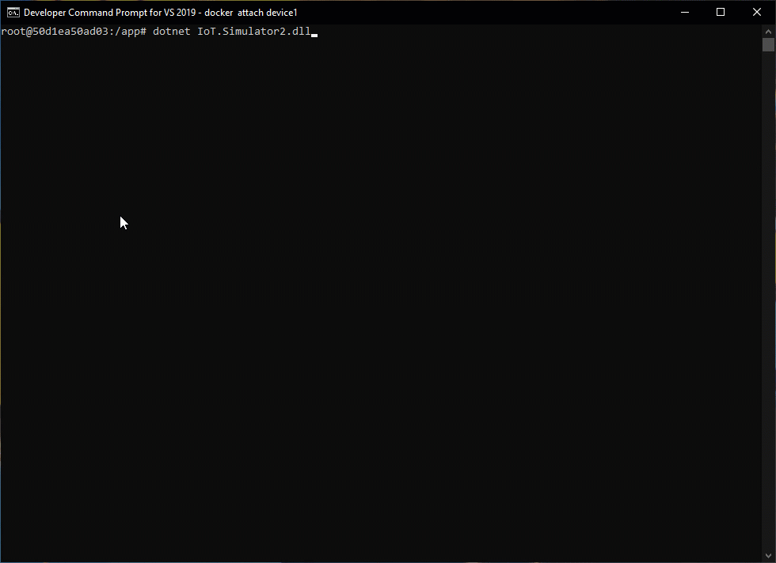

# Azure IoT Device Simulator 5 PnP - IoT Plug and Play version - Readme

This project has for purpose to help IoT developers and testers. The solution is an Azure IoT Device simulator coded with .NET 5 (C#) that implements different types of Cloud To Device (C2D) / Device To Cloud (D2C) flows between [Microsoft Azure IoT Hub](https://azure.microsoft.com/en-us/services/iot-hub/) and the simulated device.

This version of the simulator is based on the [regular version of the simulator](https://github.com/jonmikeli/azureiotdevicesimulator5), which in turn, completes the series of simulators created on top of:
 - [.Net Core 2.1](https://github.com/jonmikeli/azureiotdevicesimulator)
 - [.Net Core 3.1](https://github.com/jonmikeli/azureiotdevicesimulator3)

IoT Plug and Play is meant to facilitate the integration of IoT devices with IoT solutions, trying to imitate the concept of the already known Plug and Play experience.

Besides all these simulators, a version implementing [Device Provisioning Service (DPS) features](https://github.com/jonmikeli/azureiotdevicesimulator5-dps) completes the family of simulators.

## DTDL
This simulator allows to use [DTDL, Digital Twins Definition Language](https://github.com/Azure/opendigitaltwins-dtdl/blob/master/DTDL/v2/dtdlv2.md) models. These models describe the device capabilities via the next concepts:
 - components
 - interfaces
 - properties
 - telemetries
 - commands
 - relationships

All these are described in detail [here](https://github.com/Azure/opendigitaltwins-dtdl/blob/master/DTDL/v2/dtdlv2.md).

DTDL is based on open standards (JSON-LD and RDF).

## Models
In order to keep coherence in the whole solution (Cloud IoT part and the simulator/devices part), the used DTDL models have to be reachable from both sides.

## Additional details
 - [*How to (Quickstart)*](sources/IoT.Simulator/IoT.Simulator/docs/HowTo.md)
 - [*Help and details*](sources/IoT.Simulator/IoT.Simulator/docs/Help.md) 
 
## Examples of use
 - development tool for developers working on Microsoft Azure IoT solutions (cloud)
 - tester tool in IoT-oriented projects
 - scalable IoT simulation platforms
 - fast and simple development of IoT devices
 - etc

## Technical information
 - .NET 5 (C#)
 - Microsoft Azure IoT SDK (Device capabilities, including IoT Hub modules, a.k.a. module identities)
 - IoT Plug and Play
 - DTDL v2

 

> IOT PLUG AND PLAY VS REGULAR SIMULATOR
>
> You can find [here](https://github.com/jonmikeli/azureiotdevicesimulator5) a conventional version of the simulator (without IoT Plug and Play).
> The main difference with the IoT Plug and Play version is that it allows to easily handle with complex JSON Schemas and different types of mesages in one single device.
>
> _Which one to choose?_
> The regular simulator is recommended in contexts where:
>  - the device needs to send different types of messages.
>  - the messages will follow complex formats.
>  - you do not want implement DTDL models or use IoT Plug and Play features.
>  - DTDL v2 does not allow to implement what you need (ex: different schemas for one single message)
>
> The IoT PnP simulator is recommended in contexts where:
> - the DTDL models need to be tested
> - the IoT Plug and Play flows need to be tested
> - you already have one or many DTDL models and want to simulate the device fast and easily
> - you need to integrate your device with IoT solutions (cloud) with IoT Plug and Play capabilities

 

*Azure IoT Device Simulator logs*

 

## Global features
 - device level simulation (C2D/D2C)
 - module level simulation (C2M/M2C)
 - device simulation configuration based on JSON files
 - module simulation configuration based on JSON files
 - no specific limitation on the number of modules (only limited by Microsoft Azure IoT Hub constraints)
 - simple and lightweight application, containerizable
 - implementation of full IoT flows (C2D, D2C, C2M, M2C) - see below for more details

## Functional features

### Device level (C2D/D2C)

*Commands*
 - request latency test
 - reboot device
 - device On/Off
 - read device Twin
 - generic command (with JSON payload)
 - generic command
 - update telemetry interval
 
 *Messages*
 D2C: The device will send the telemetries according the referenced DTDL model.
 
 C2D: Microsoft Azure IoT Hub can send messages to a given device.
 
 *Twin*
 Any change in the Desired properties is notified and handled by the device.

### Module level (C2M/M2C)
Commands have also been implemented at device module level.

>NOTE
>
>Latency tests will not be included at modules level.

  
## Global technical features

Functional features are based on these generic technical features:
 - telemetry sent from a device.
 - a device may contain one or many modules.
 - each module behaves independently with its own flows (C2M/M2C) and its configuration settings.
 - the device that contains the modules has its own behavior (based on its own configuration file).
 - telemetry sent from a module.
 - messages received by a device.
 - messages received by a module.
 - commands received by a device.
 - commands received by a module.
 - Twin Desired properties changed notification (for devices).
 - Twin Desired properties changed notification (for modules).
 - Twin Reported properties updates from a device.
 - Twin Reported properties updates from a module.

### D2C
#### Device level
 - IoT Messages
 - Twins (Reported)

#### Module level (M2C)
 - IoT Messages
 - Twins (Reported)

### C2D
#### Device level
 - Twins (Desired)
 - Twins (Tags)
 - Direct Methods
 - Messages

#### Module level (C2M)
 - Twins (Desired)
 - Twins (Tags)
 - Direct Methods
 - Messages

## More information

- Details about **HOW the solution WORKS** are provided in the [help](sources/IoT.Simulator/IoT.Simulator/docs/Help.md) section.
- Details about **HOW the solution can be USED** are provided in the [how to](sources/IoT.Simulator/IoT.Simulator/docs/HowTo.md) section.
