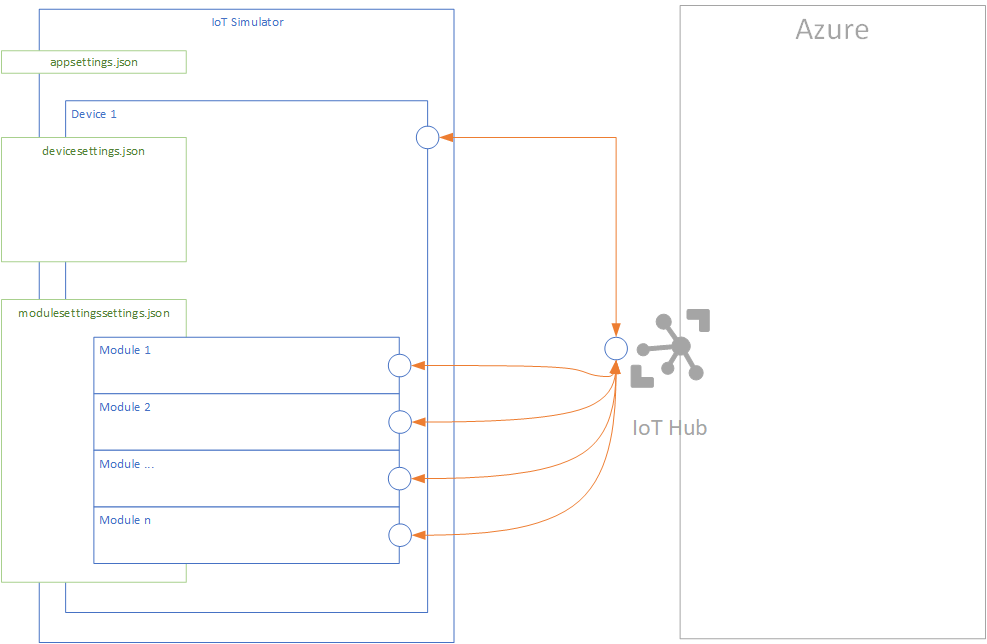

# Azure IoT Device Simulator - Help

This section describes the different artifacts of the solution and how they work.

## Application
The application consists of:
 - an application console (.NET 5)
 - configuration files:
   - [appsettings.json](####appsettings.json) (described below)
   - [devicesettings.json](####devicesettings.json) (described below). It includes the references to the used DTDL models.
   - [modulessettings.json](####modulessettings.json) (described below). It includes the references to the used DTDL models.


<br/>

*Global device model architecture*




<br/>

## Features

The simulator parses and processes the provided DTDL model.
It extracts the:
 - components
 - properties
 - telemetries
 - commands


### Components
Components are processed looking for propertie, telemetries and/or commands.

### Properties
Readable and writable properties are extracted from the provided model.

Readable properties (a.k.a. reported properties) are parsed and listed. The simulator does not use them for now.
Writable properties are parsed and listed. They are compared to the received desired properties to control if the received values are coherent with the model.

### Telemtries
Telemetries are extracted from the provided model.
They can be defined with other types of model items or separated in referenced models (through components).

THe simulator uses them to create dynamic messages with random values according to the types defined in the DTDL model.

### Commands
Commands are extracted from the provided model.
They are processed as IoT Direct Commands. The simulator creates a handler for each command defined in the DTDL.

In addition to the commands defined in the DTDL model, the simulator includes amny other Direct Method handlers for developing purposes.

|Method name|Description|Request|Response|Comments|
|:-|:-|:-|:-|:-|
| SendLatencyTest | Allows to start a [latency](LatencyTests.md) test between a given device and the Microsoft Azure IoT Hub where the device is registered. | ```{ "deviceId":"", "messageType":"latency", "startTimestamp":12345} ```| NA |The request contains the initial  timpestamp, which is sent back to the device after all the process in order to allow him to measure latency. <br>***NOTE: this feature requires an [Azure Function](https://github.com/jonmikeli/azureiotdevicesimulator/tree/master/sources/IoT.Simulator/IoT.Simulator.AF) responding to the latency test requests and calling back the C2D LatencyTestCallBack Direct Method.***|
|LatencyTestCallBack|Allows to end a [latency](LatencyTests.md) test between a given device and the Microsoft Azure IoT Hub where the device is registered. |```startTimestamp``` value, allowing to math the [latency](LatencyTests.md) (string)|<ul><li>message notifying that the LatencyTestCallBack Direct Method has been called (string).</li><li> result code, 200</li></ul>|NA|
| Reboot | Simulates a device reboot operation. | NA | <ul><li>message notifiying that the Reboot Direct Method has been called (string).</li><li> result code, 200</li></ul>|Sends Twins (Reported properties) notifying the reboot.|
| OnOff | Turns a given device on/off. | JSON Object | <ul><li>message notifying that the OnOff Direct Method has been called (string). The message contains request's payload.</li><li> result code, 200</li></ul>|
| ReadTwins | Orders a given device to read its Twin data. | NA | <ul><li>message notifying that the ReadTwins Direct Method has been called (string).</li><li>result code, 200</li></ul>|
| GenericJToken | Generic method | JSON Token | <ul><li>message notifying that the GenericJToken Direct Method has been called (string).</li><li> result code, 200</li></ul>|
| Generic | Generic method | string | <ul><li>message notifying that the Generic Direct Method has been called (string).</li><li> result code, 200</li></ul>|
| SetTelemetryInterval | Updates the time rate used to send telemetry data. | seconds (int) | <ul><li>message notifying that the SetTelemetryInterval Direct Method has been called (string).</li><li> result code, 200</li></ul>|


### Modules

#### M2C
##### Messages
The approach at modules level is exactly the same that the approach at the device level.

#### C2M
##### Direct Methods

The simulator includes a default set of commands that can be used as Direct Methods.

|Method name |Description|Request|Response|Comments|
|:-|:-|:-|:-|:-|
| Reboot | Simulates a device reboot operation. | NA | <ul><li>message notifying that the Reboot Direct Method has been called (string).</li><li> result code, 200</li></ul>|Sends Twins (Reported properties) notifying the reboot.|
| OnOff | Turns a given device on/off. | JSON Object | <ul><li>message notifying that the OnOff Direct Method has been called (string). The message contains request's payload.</li><li> result code, 200</li></ul>|
| ReadTwins | Orders a given device to read its Twin data. | NA | <ul><li>message notifying that the ReadTwins Direct Method has been called (string).</li><li>result code, 200.</li></ul>|
| GenericJToken | Generic method | JSON Token | <ul><li>message notifying that the GenericJToken Direct Method has been called (string).</li><li> result code, 200</li></ul>|
| Generic | Generic method | string | <ul><li>message notifying that the Generic Direct Method has been called (string).</li><li> result code, 200</li></ul>|
| SetTelemetryInterval | Updates the time rate used to send telemetry data. | seconds (int) | <ul><li>message notifying that the SetTelemetryInterval Direct Method has been called (string).</li><li> result code, 200</li></ul>|

The approach at modules level is exactly the same that the approach at the device level.


## How does the simulator work?
### Description
The application is configurable by an ***appsettings.json*** file.

The features of the application rely on the components below:
 - device (**one single device per application**)
 - modules (**none, one or many modules per device**)
 - DTDL v2 models
 
 The device component is configured by a ***devicesettings.json*** file while the modules are configured by a ***modulessettings.json*** file.

<br/>

 *Device model architecture*
 

<br/>

### Runing the simulator
 The simulator is a .NET 5  application.
 
 To run the simulator, there are two alternatives:
  1. running the simulator as a **.NET 5 Console application** (selfcontained or depending on an installed framework)
  1. running the *Docker container* (which contains in turn the .NET 5 binaries, packages and other required prerequisites)
 
 #### Runing .NET Core application
 Run the command below:
 ```dotnet
 dotnet IoT.Simulator.dll
 ```

 #### Runing Docker container
 ```cmd
 docker run -ti --name [containername] [imagename]
 ```

 ### Configurations
 #### Application
 Technical settings of the application can be configured at *appsettings.json*.

 > Example (Production environment):
 ```json
 {
  "Logging": {
    "LogLevel": {
      "Default": "Warning"
    }
  }
}
 ```


 > [!NOTE]
 >
 > The solution contains different settings depending on the environment (similar to transformation files).


 > Example (Development environment) - *appsettings.Development.json*:
  ```json
 {
  "Logging": {
    "Debug": {
      "LogLevel": {
        "Default": "Trace"
      }
    },
    "Console": {
      "IncludeScopes": true,
      "LogLevel": {
        "Default": "Trace"
      }
    },
    "LogLevel": {
      "Default": "Trace",
      "System": "Trace",
      "Microsoft": "Trace"
    }
  }
}
 ```


#### Device
IoT Simulator is linked to **one and only one** device.
The device behavior is configured by the *devicessettings.json* configuration file.

> Example:

```json
{
  "connectionString": "HostName=[IOTHUB NAME].azure-devices.net;DeviceId=[DEVICE ID];SharedAccessKey=[KEY]",
  "defaultModelId": "dtmi:com:example:thermostat;1",
  "supportedModels": [
    {
      "modelId": "dtmi:com:example:thermostat;1",
      "modelPath": "[HTTP path or local physical path to the model definition]",
      "modelType": "Telemetry" //Telemetry, Error, Warning
    },
    {
      "modelId": "dtmi:com:jmi:simulator:devicemessages;1",
      "modelPath": "[HTTP path or local physical path to the model definition]",
      "modelType": "Telemetry" //Telemetry, Error, Warning
    }
  ],
  "simulationSettings": {
    "enableLatencyTests": false,
    "latencyTestsFrecuency": 10,
    "enableDevice": true,
    "enableModules": true,
    "enableTelemetryMessages": false,
    "telemetryFrecuency": 60,
    "enableErrorMessages": false,
    "errorFrecuency": 60,
    "enableCommissioningMessages": false,
    "commissioningFrecuency": 60,
    "enableTwinReportedMessages": false,
    "twinReportedMessagesFrecuency": 60,
    "enableReadingTwinProperties": false,
    "enableC2DDirectMethods": true,
    "enableC2DMessages": true,
    "enableTwinPropertiesDesiredChangesNotifications": true
  }
}
```
Properties are quite self-explanatory.

> [!NOTE]
> 
> Emission intervals are set in seconds.


##### IoT Plug and Play related settings

A few settings are related to IoT Plug and Play (IoT PnP):

```json
...
"defaultModelId": "dtmi:com:example:thermostat;1",
  "supportedModels": [
    {
      "modelId": "dtmi:com:example:thermostat;1",
      "modelPath": "[HTTP path or local physical path to the model definition]",
      "modelType": "Telemetry" //Telemetry, Error, Warning
    },
    {
      "modelId": "dtmi:com:jmi:simulator:devicemessages;1",
      "modelPath": "[HTTP path or local physical path to the model definition]",
      "modelType": "Telemetry" //Telemetry, Error, Warning
    }
  ]
...
```
These properties ARE NOT PART of IoT PnP or DTDL. They are custom properties created for the simulator.

Description:
- defaultModelId: it contains the default DTDL model Id. It is mandatory in this version of IoT Simulator.
- supportedModels: a collection of the supported models by the simulator. This notion of "collection" does not exist in DTDL v2. However, many real life projects may need this. Be sure that one of the supported models is the default model.
  - modelId: DTDL model Id (in DTDL expected format). Refer to the documentation [here](https://github.com/Azure/opendigitaltwins-dtdl/blob/master/DTDL/v2/dtdlv2.md) for details about the format.
  - modelPath: path of the JSON containing the DTDL model. This path can be local or remote (http based path).
  - modelType: describes the model type. This notion does not exist either in DTDL. Having decided to support many models in the simulator, this property allows to give a type to each of them (ex: Telemetry, Error, Warning).

> NOTE
>
> At least one supported model is required.
> The default model id has to be one of the values included in the supported models.


#### Modules
IoT Simulator's device may contain **zero, one or more modules but no module is mandatory**.
Behaviors of modules are configured by the *modulessettings.json* configuration file.


> Example of a configuration file of two modules:
```json
{
 "modules":[
    {
        "connectionString": "[IOT HUB NAME].azure-devices.net;DeviceId=[DEVIVE ID];ModuleId=[MODULE ID];SharedAccessKey=[SHARED KEY]",
        "defaultModelId": "dtmi:com:example:thermostat;1",
        "supportedModels": [
          {
            "modelId": "dtmi:com:example:thermostat;1",
            "modelPath": "./DTDLModels/thermostat.json",
            "modelType": "Telemetry"
          }
        ],
        "simulationSettings": {
          "enableTelemetryMessages": true,
          "telemetryFrecuency": 20,
          "enableTwinReportedMessages": false,
          "twinReportedMessagesFrecuency": 60,
          "enableReadingTwinProperties": true,
          "enableC2DDirectMethods": true,
          "enableC2DMessages": true,
          "enableTwinPropertiesDesiredChangesNotifications": true
        }
    },
    {
        "connectionString": "[IOT HUB NAME].azure-devices.net;DeviceId=[DEVIVE ID];ModuleId=[MODULE ID];SharedAccessKey=[SHARED KEY]",
        "defaultModelId": "dtmi:com:example:thermostat;1",
        "supportedModels": [
          {
            "modelId": "dtmi:com:example:thermostat;1",
            "modelPath": "./DTDLModels/thermostat.json",
            "modelType": "Telemetry"
          }
        ],
        "simulationSettings": {
          "enableTelemetryMessages": true,
          "telemetryFrecuency": 20,
          "enableTwinReportedMessages": false,
          "twinReportedMessagesFrecuency": 60,
          "enableReadingTwinProperties": true,
          "enableC2DDirectMethods": true,
          "enableC2DMessages": true,
          "enableTwinPropertiesDesiredChangesNotifications": true
        }
    }
  ]
}
```

> [!NOTE]
> 
> Emission intervals are set in seconds.

_The IoT PnP integration with modules has not been implemented yet. However, the approach should be exactly the same than with devices_.


## Evolutivity

This version of the IoT PnP simulator relies on a generic approach to protect the developments against possible DTDL evolutions.
It turns out that the DTDL definition remains quite stable.
In this case, it is maybe worth considering rewriting the simulator with a strong typed approach.
Maintenability and evolutivity will be improved.

Additionnally, I guess parts of the code may be reviewed or improved.

The DTDL parsing has been encapsulated in an external library, packaged in turn in a NuGet package.

# Glossary

A few explanations about specific vocabulary to be sure all the terms are understood in the context of this document.

## Commissioning

Commissioning represents the act of linking a provisioned device and a user (or user related information).

## Provisioning

Provisioning represents the action of creating an identity for the device in the Microsoft Azure IoT Hub.

## Azure IoT related vocabulary

## Twin
[Device twins](https://docs.microsoft.com/en-us/azure/iot-hub/iot-hub-devguide-device-twins) store device state information including metadata, configurations, and conditions. Microsoft Azure IoT Hub maintains a device twin for each device that you connect to IoT Hub.

Similarly, [module twins](https://docs.microsoft.com/en-us/azure/iot-hub/iot-hub-devguide-module-twins) play the same role thant device twins but at module level.

Twins contain 3 main sections:
 - Tags
 - Properties (Desired)
 - Properties (Reported)

For more details, follow the links provided.

## Tags
A section of the JSON document that the solution back end can read from and write to. Tags are not visible to device apps.

## Twin Desired properties
Used along with reported properties to synchronize device configuration or conditions. The solution back end can set desired properties, and the device app can read them. The device app can also receive notifications of changes in the desired properties.

## Twin Reported properties
Used along with desired properties to synchronize device configuration or conditions. The device app can set reported properties, and the solution back end can read and query them.